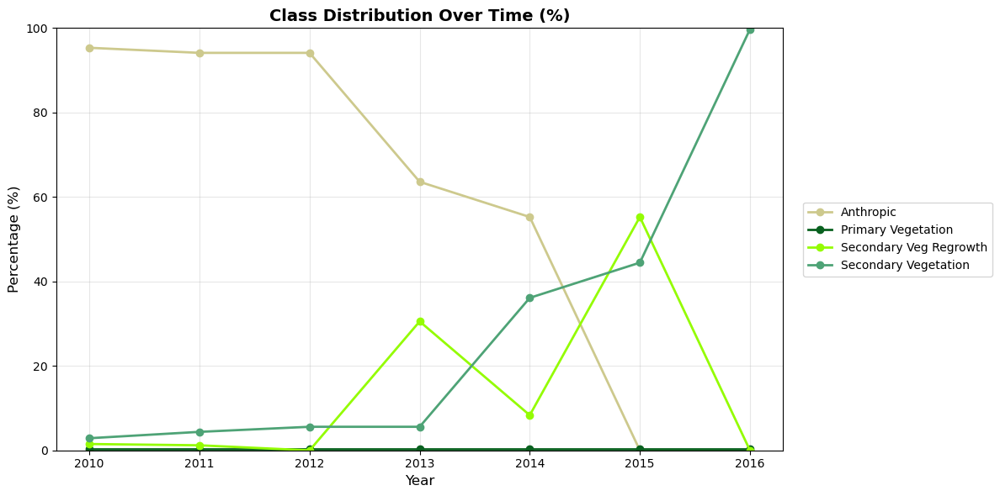

# charts


<!-- WARNING: THIS FILE WAS AUTOGENERATED! DO NOT EDIT! -->

<cell_type>markdown</cell_type>\## Default Color Palette

A colorblind-friendly palette based on ColorBrewer, used when no layer
palette or custom colors are provided.

## Data Preparation

Helper functions to transform extraction results into chart-ready
formats.

            <style>
                .geemap-dark {
                    --jp-widgets-color: white;
                    --jp-widgets-label-color: white;
                    --jp-ui-font-color1: white;
                    --jp-layout-color2: #454545;
                    background-color: #383838;
                }
&#10;                .geemap-dark .jupyter-button {
                    --jp-layout-color3: #383838;
                }
&#10;                .geemap-colab {
                    background-color: var(--colab-primary-surface-color, white);
                }
&#10;                .geemap-colab .jupyter-button {
                    --jp-layout-color3: var(--colab-primary-surface-color, white);
                }
            </style>
            &#10;

------------------------------------------------------------------------

<a
href="https://github.com/aliceheiman/gee-polygons/blob/main/gee_polygons/charts.py#L40"
target="_blank" style="float:right; font-size:smaller">source</a>

### prepare_chart_data

``` python

def prepare_chart_data(
    df:DataFrame, value_col:str='area_ha', as_percentage:bool=False
)->DataFrame:

```

*Pivot extraction data for charting.*

Args: df: DataFrame from extract_categorical with columns: site_id,
year, class_value, count, area_ha, class_name value_col: Column to use
for values (‘area_ha’ or ‘count’) as_percentage: If True, convert to
percentages per year

Returns: Pivoted DataFrame with years as index, classes as columns

            <style>
                .geemap-dark {
                    --jp-widgets-color: white;
                    --jp-widgets-label-color: white;
                    --jp-ui-font-color1: white;
                    --jp-layout-color2: #454545;
                    background-color: #383838;
                }
&#10;                .geemap-dark .jupyter-button {
                    --jp-layout-color3: #383838;
                }
&#10;                .geemap-colab {
                    background-color: var(--colab-primary-surface-color, white);
                }
&#10;                .geemap-colab .jupyter-button {
                    --jp-layout-color3: var(--colab-primary-surface-color, white);
                }
            </style>
            &#10;

------------------------------------------------------------------------

<a
href="https://github.com/aliceheiman/gee-polygons/blob/main/gee_polygons/charts.py#L77"
target="_blank" style="float:right; font-size:smaller">source</a>

### get_class_colors

``` python

def get_class_colors(
    classes:list, custom_colors:Optional=None, layer:Optional=None
)->dict:

```

*Get colors for each class, using layer palette, custom, or defaults.*

Priority order: 1. custom_colors (if provided) 2. layer.palette (if
layer provided and has palette) 3. DEFAULT_PALETTE cycle

Args: classes: List of class names custom_colors: Optional dict mapping
class names to hex colors layer: Optional CategoricalLayer with palette
attribute

Returns: Dict mapping class names to colors

## Static Charts (Matplotlib)

Publication-ready static visualizations.

            <style>
                .geemap-dark {
                    --jp-widgets-color: white;
                    --jp-widgets-label-color: white;
                    --jp-ui-font-color1: white;
                    --jp-layout-color2: #454545;
                    background-color: #383838;
                }
&#10;                .geemap-dark .jupyter-button {
                    --jp-layout-color3: #383838;
                }
&#10;                .geemap-colab {
                    background-color: var(--colab-primary-surface-color, white);
                }
&#10;                .geemap-colab .jupyter-button {
                    --jp-layout-color3: var(--colab-primary-surface-color, white);
                }
            </style>
            &#10;

------------------------------------------------------------------------

<a
href="https://github.com/aliceheiman/gee-polygons/blob/main/gee_polygons/charts.py#L123"
target="_blank" style="float:right; font-size:smaller">source</a>

### plot_class_distribution

``` python

def plot_class_distribution(
    df:DataFrame, title:str='Class Distribution Over Time (%)', colors:Optional=None, layer:Optional=None,
    figsize:tuple=(12, 6), marker:str='o', linewidth:float=2, markersize:float=6, grid:bool=True,
    legend_loc:str='center left', legend_bbox:tuple=(1.02, 0.5)
)->tuple:

```

*Create a line chart showing class distribution percentages over time.*

Args: df: DataFrame from extract_categorical title: Chart title colors:
Optional dict mapping class names to hex colors layer: Optional
CategoricalLayer to extract colors from palette figsize: Figure size
(width, height) marker: Marker style for data points linewidth: Width of
lines markersize: Size of markers grid: Whether to show grid legend_loc:
Legend location legend_bbox: Legend bbox_to_anchor

Returns: Tuple of (figure, axes)

            <style>
                .geemap-dark {
                    --jp-widgets-color: white;
                    --jp-widgets-label-color: white;
                    --jp-ui-font-color1: white;
                    --jp-layout-color2: #454545;
                    background-color: #383838;
                }
&#10;                .geemap-dark .jupyter-button {
                    --jp-layout-color3: #383838;
                }
&#10;                .geemap-colab {
                    background-color: var(--colab-primary-surface-color, white);
                }
&#10;                .geemap-colab .jupyter-button {
                    --jp-layout-color3: var(--colab-primary-surface-color, white);
                }
            </style>
            &#10;

------------------------------------------------------------------------

<a
href="https://github.com/aliceheiman/gee-polygons/blob/main/gee_polygons/charts.py#L188"
target="_blank" style="float:right; font-size:smaller">source</a>

### plot_class_area_stacked

``` python

def plot_class_area_stacked(
    df:DataFrame, title:str='Area by Class Over Time (hectares)', colors:Optional=None, layer:Optional=None,
    figsize:tuple=(12, 6), bar_width:float=0.7, grid:bool=True, legend_loc:str='center left',
    legend_bbox:tuple=(1.02, 0.5)
)->tuple:

```

*Create a stacked bar chart showing area by class over time.*

Args: df: DataFrame from extract_categorical title: Chart title colors:
Optional dict mapping class names to hex colors layer: Optional
CategoricalLayer to extract colors from palette figsize: Figure size
(width, height) bar_width: Width of bars grid: Whether to show grid
legend_loc: Legend location legend_bbox: Legend bbox_to_anchor

Returns: Tuple of (figure, axes)

## Interactive Charts (Plotly)

Interactive visualizations with hover info, zoom, and pan.

            <style>
                .geemap-dark {
                    --jp-widgets-color: white;
                    --jp-widgets-label-color: white;
                    --jp-ui-font-color1: white;
                    --jp-layout-color2: #454545;
                    background-color: #383838;
                }
&#10;                .geemap-dark .jupyter-button {
                    --jp-layout-color3: #383838;
                }
&#10;                .geemap-colab {
                    background-color: var(--colab-primary-surface-color, white);
                }
&#10;                .geemap-colab .jupyter-button {
                    --jp-layout-color3: var(--colab-primary-surface-color, white);
                }
            </style>
            &#10;

------------------------------------------------------------------------

<a
href="https://github.com/aliceheiman/gee-polygons/blob/main/gee_polygons/charts.py#L265"
target="_blank" style="float:right; font-size:smaller">source</a>

### plot_class_distribution_interactive

``` python

def plot_class_distribution_interactive(
    df:DataFrame, title:str='Class Distribution Over Time (%)', colors:Optional=None, layer:Optional=None,
    height:int=500, width:Optional=None, line_width:float=2, marker_size:float=8
)->go.Figure:

```

*Create an interactive line chart showing class distribution
percentages.*

Args: df: DataFrame from extract_categorical title: Chart title colors:
Optional dict mapping class names to hex colors layer: Optional
CategoricalLayer to extract colors from palette height: Chart height in
pixels width: Chart width in pixels (None for auto) line_width: Width of
lines marker_size: Size of markers

Returns: Plotly Figure object

            <style>
                .geemap-dark {
                    --jp-widgets-color: white;
                    --jp-widgets-label-color: white;
                    --jp-ui-font-color1: white;
                    --jp-layout-color2: #454545;
                    background-color: #383838;
                }
&#10;                .geemap-dark .jupyter-button {
                    --jp-layout-color3: #383838;
                }
&#10;                .geemap-colab {
                    background-color: var(--colab-primary-surface-color, white);
                }
&#10;                .geemap-colab .jupyter-button {
                    --jp-layout-color3: var(--colab-primary-surface-color, white);
                }
            </style>
            &#10;

------------------------------------------------------------------------

<a
href="https://github.com/aliceheiman/gee-polygons/blob/main/gee_polygons/charts.py#L336"
target="_blank" style="float:right; font-size:smaller">source</a>

### plot_class_area_stacked_interactive

``` python

def plot_class_area_stacked_interactive(
    df:DataFrame, title:str='Area by Class Over Time (hectares)', colors:Optional=None, layer:Optional=None,
    height:int=500, width:Optional=None
)->go.Figure:

```

*Create an interactive stacked bar chart showing area by class.*

Args: df: DataFrame from extract_categorical title: Chart title colors:
Optional dict mapping class names to hex colors layer: Optional
CategoricalLayer to extract colors from palette height: Chart height in
pixels width: Chart width in pixels (None for auto)

Returns: Plotly Figure object

## Convenience Functions

High-level functions for common use cases.

            <style>
                .geemap-dark {
                    --jp-widgets-color: white;
                    --jp-widgets-label-color: white;
                    --jp-ui-font-color1: white;
                    --jp-layout-color2: #454545;
                    background-color: #383838;
                }
&#10;                .geemap-dark .jupyter-button {
                    --jp-layout-color3: #383838;
                }
&#10;                .geemap-colab {
                    background-color: var(--colab-primary-surface-color, white);
                }
&#10;                .geemap-colab .jupyter-button {
                    --jp-layout-color3: var(--colab-primary-surface-color, white);
                }
            </style>
            &#10;

------------------------------------------------------------------------

<a
href="https://github.com/aliceheiman/gee-polygons/blob/main/gee_polygons/charts.py#L402"
target="_blank" style="float:right; font-size:smaller">source</a>

### plot_extraction

``` python

def plot_extraction(
    df:DataFrame, chart_type:str='distribution', interactive:bool=False, layer:Optional=None, kwargs:VAR_KEYWORD
):

```

*Universal plotting function for extraction results.*

Args: df: DataFrame from extract_categorical chart_type: ‘distribution’
(line %) or ‘area’ (stacked bar) interactive: If True, use plotly; if
False, use matplotlib layer: Optional CategoricalLayer to extract colors
from palette \*\*kwargs: Additional arguments passed to the underlying
plot function

Returns: Figure object (matplotlib or plotly)

## Aggregated Class Charts

Sometimes multiple classes represent components of the same concept. For
example, “Secondary Vegetation” + “Secondary Veg Regrowth” together
represent total restoration progress.

The
[`plot_aggregated`](https://aliceheiman.github.io/gee-polygons/charts.html#plot_aggregated)
function lets you define aggregates and visualize both components
(dashed) and totals (solid).

            <style>
                .geemap-dark {
                    --jp-widgets-color: white;
                    --jp-widgets-label-color: white;
                    --jp-ui-font-color1: white;
                    --jp-layout-color2: #454545;
                    background-color: #383838;
                }
&#10;                .geemap-dark .jupyter-button {
                    --jp-layout-color3: #383838;
                }
&#10;                .geemap-colab {
                    background-color: var(--colab-primary-surface-color, white);
                }
&#10;                .geemap-colab .jupyter-button {
                    --jp-layout-color3: var(--colab-primary-surface-color, white);
                }
            </style>
            &#10;

------------------------------------------------------------------------

<a
href="https://github.com/aliceheiman/gee-polygons/blob/main/gee_polygons/charts.py#L435"
target="_blank" style="float:right; font-size:smaller">source</a>

### plot_aggregated

``` python

def plot_aggregated(
    df:DataFrame, aggregates:dict, title:str='Aggregated Class Distribution', colors:Optional=None,
    layer:Optional=None, show_components:bool=True, vlines:Optional=None, vline_color:str='#666666',
    figsize:tuple=(12, 6), linewidth:float=2, marker:str='o', markersize:float=6, grid:bool=True,
    legend_loc:str='center left', legend_bbox:tuple=(1.02, 0.5)
)->tuple:

```

*Plot aggregated classes with components shown as dashed lines.*

Args: df: DataFrame from extract_categorical aggregates: Dict mapping
aggregate name to list of component class names. Example:
{‘total_restoration’: \[‘Secondary Vegetation’, ‘Secondary Veg
Regrowth’\]} title: Chart title colors: Optional dict mapping
class/aggregate names to hex colors layer: Optional CategoricalLayer to
extract colors from palette show_components: If True, show component
classes as dashed lines vlines: Optional dict mapping years to labels
for vertical reference lines. Example: {2012: ‘Restoration Start’}
vline_color: Color for vertical lines (default gray) figsize: Figure
size (width, height) linewidth: Width of lines marker: Marker style
markersize: Size of markers grid: Whether to show grid legend_loc:
Legend location legend_bbox: Legend bbox_to_anchor

Returns: Tuple of (figure, axes)

            <style>
                .geemap-dark {
                    --jp-widgets-color: white;
                    --jp-widgets-label-color: white;
                    --jp-ui-font-color1: white;
                    --jp-layout-color2: #454545;
                    background-color: #383838;
                }
&#10;                .geemap-dark .jupyter-button {
                    --jp-layout-color3: #383838;
                }
&#10;                .geemap-colab {
                    background-color: var(--colab-primary-surface-color, white);
                }
&#10;                .geemap-colab .jupyter-button {
                    --jp-layout-color3: var(--colab-primary-surface-color, white);
                }
            </style>
            &#10;

------------------------------------------------------------------------

<a
href="https://github.com/aliceheiman/gee-polygons/blob/main/gee_polygons/charts.py#L544"
target="_blank" style="float:right; font-size:smaller">source</a>

### plot_aggregated_interactive

``` python

def plot_aggregated_interactive(
    df:DataFrame, aggregates:dict, title:str='Aggregated Class Distribution', colors:Optional=None,
    layer:Optional=None, show_components:bool=True, vlines:Optional=None, vline_color:str='#666666', height:int=500,
    width:Optional=None, line_width:float=2, marker_size:float=8
)->go.Figure:

```

*Create an interactive aggregated class chart with plotly.*

Args: df: DataFrame from extract_categorical aggregates: Dict mapping
aggregate name to list of component class names. title: Chart title
colors: Optional dict mapping class/aggregate names to hex colors layer:
Optional CategoricalLayer to extract colors from palette
show_components: If True, show component classes as dashed lines vlines:
Optional dict mapping years to labels for vertical reference lines.
Example: {2012: ‘Restoration Start’} vline_color: Color for vertical
lines (default gray) height: Chart height in pixels width: Chart width
in pixels (None for auto) line_width: Width of lines marker_size: Size
of markers

Returns: Plotly Figure object

## Example Usage

Let’s demonstrate the charts with real data from the DEFREG dataset.

``` python
# Initialize Earth Engine
import ee
ee.Authenticate()
ee.Initialize(project='hs-brazilreforestation')
```

    /Users/alice/.local/share/mamba/envs/gee-polygons/lib/python3.10/site-packages/google/api_core/_python_version_support.py:275: FutureWarning: You are using a Python version (3.10.19) which Google will stop supporting in new releases of google.api_core once it reaches its end of life (2026-10-04). Please upgrade to the latest Python version, or at least Python 3.11, to continue receiving updates for google.api_core past that date.
      warnings.warn(message, FutureWarning)

``` python
# Load a site and extract data
from gee_polygons.site import load_sites
from gee_polygons.datasets.mapbiomas import MAPBIOMAS_DEFREG

sites = load_sites('../data/restoration_sites_subset.geojson')
site = sites[8]
print(site)

# Extract DEFREG data for multiple years
df = site.extract_categorical(MAPBIOMAS_DEFREG, years=range(2010, 2017))
df.head(10)
```

            <style>
                .geemap-dark {
                    --jp-widgets-color: white;
                    --jp-widgets-label-color: white;
                    --jp-ui-font-color1: white;
                    --jp-layout-color2: #454545;
                    background-color: #383838;
                }
&#10;                .geemap-dark .jupyter-button {
                    --jp-layout-color3: #383838;
                }
&#10;                .geemap-colab {
                    background-color: var(--colab-primary-surface-color, white);
                }
&#10;                .geemap-colab .jupyter-button {
                    --jp-layout-color3: var(--colab-primary-surface-color, white);
                }
            </style>
            &#10;

    Site(id=9368, start_year=2012)

<div>
<style scoped>
    .dataframe tbody tr th:only-of-type {
        vertical-align: middle;
    }
&#10;    .dataframe tbody tr th {
        vertical-align: top;
    }
&#10;    .dataframe thead th {
        text-align: right;
    }
</style>

<table class="dataframe" data-quarto-postprocess="true" data-border="1">
<thead>
<tr style="text-align: right;">
<th data-quarto-table-cell-role="th"></th>
<th data-quarto-table-cell-role="th">site_id</th>
<th data-quarto-table-cell-role="th">year</th>
<th data-quarto-table-cell-role="th">class_value</th>
<th data-quarto-table-cell-role="th">count</th>
<th data-quarto-table-cell-role="th">area_ha</th>
<th data-quarto-table-cell-role="th">class_name</th>
</tr>
</thead>
<tbody>
<tr>
<td data-quarto-table-cell-role="th">0</td>
<td>9368</td>
<td>2010</td>
<td>1</td>
<td>149.090196</td>
<td>13.418118</td>
<td>Anthropic</td>
</tr>
<tr>
<td data-quarto-table-cell-role="th">1</td>
<td>9368</td>
<td>2010</td>
<td>2</td>
<td>0.462745</td>
<td>0.041647</td>
<td>Primary Vegetation</td>
</tr>
<tr>
<td data-quarto-table-cell-role="th">2</td>
<td>9368</td>
<td>2010</td>
<td>3</td>
<td>4.501961</td>
<td>0.405176</td>
<td>Secondary Vegetation</td>
</tr>
<tr>
<td data-quarto-table-cell-role="th">3</td>
<td>9368</td>
<td>2010</td>
<td>5</td>
<td>2.352941</td>
<td>0.211765</td>
<td>Secondary Veg Regrowth</td>
</tr>
<tr>
<td data-quarto-table-cell-role="th">4</td>
<td>9368</td>
<td>2011</td>
<td>1</td>
<td>147.211765</td>
<td>13.249059</td>
<td>Anthropic</td>
</tr>
<tr>
<td data-quarto-table-cell-role="th">5</td>
<td>9368</td>
<td>2011</td>
<td>2</td>
<td>0.462745</td>
<td>0.041647</td>
<td>Primary Vegetation</td>
</tr>
<tr>
<td data-quarto-table-cell-role="th">6</td>
<td>9368</td>
<td>2011</td>
<td>3</td>
<td>6.854902</td>
<td>0.616941</td>
<td>Secondary Vegetation</td>
</tr>
<tr>
<td data-quarto-table-cell-role="th">7</td>
<td>9368</td>
<td>2011</td>
<td>5</td>
<td>1.878431</td>
<td>0.169059</td>
<td>Secondary Veg Regrowth</td>
</tr>
<tr>
<td data-quarto-table-cell-role="th">8</td>
<td>9368</td>
<td>2012</td>
<td>1</td>
<td>147.211765</td>
<td>13.249059</td>
<td>Anthropic</td>
</tr>
<tr>
<td data-quarto-table-cell-role="th">9</td>
<td>9368</td>
<td>2012</td>
<td>2</td>
<td>0.462745</td>
<td>0.041647</td>
<td>Primary Vegetation</td>
</tr>
</tbody>
</table>

</div>

### Static Charts (Matplotlib)

``` python
# Line chart: Class distribution over time (%)
# Pass the layer to automatically use MapBiomas DEFREG colors
fig, ax = plot_class_distribution(df, layer=MAPBIOMAS_DEFREG)
plt.show()
```

            <style>
                .geemap-dark {
                    --jp-widgets-color: white;
                    --jp-widgets-label-color: white;
                    --jp-ui-font-color1: white;
                    --jp-layout-color2: #454545;
                    background-color: #383838;
                }
&#10;                .geemap-dark .jupyter-button {
                    --jp-layout-color3: #383838;
                }
&#10;                .geemap-colab {
                    background-color: var(--colab-primary-surface-color, white);
                }
&#10;                .geemap-colab .jupyter-button {
                    --jp-layout-color3: var(--colab-primary-surface-color, white);
                }
            </style>
            &#10;



``` python
# Stacked bar chart: Area by class over time
fig, ax = plot_class_area_stacked(df, layer=MAPBIOMAS_DEFREG)
plt.show()
```

            <style>
                .geemap-dark {
                    --jp-widgets-color: white;
                    --jp-widgets-label-color: white;
                    --jp-ui-font-color1: white;
                    --jp-layout-color2: #454545;
                    background-color: #383838;
                }
&#10;                .geemap-dark .jupyter-button {
                    --jp-layout-color3: #383838;
                }
&#10;                .geemap-colab {
                    background-color: var(--colab-primary-surface-color, white);
                }
&#10;                .geemap-colab .jupyter-button {
                    --jp-layout-color3: var(--colab-primary-surface-color, white);
                }
            </style>
            &#10;


### Interactive Charts (Plotly)

``` python
# Interactive line chart
fig = plot_class_distribution_interactive(df, layer=MAPBIOMAS_DEFREG)
fig.show()
```

            <style>
                .geemap-dark {
                    --jp-widgets-color: white;
                    --jp-widgets-label-color: white;
                    --jp-ui-font-color1: white;
                    --jp-layout-color2: #454545;
                    background-color: #383838;
                }
&#10;                .geemap-dark .jupyter-button {
                    --jp-layout-color3: #383838;
                }
&#10;                .geemap-colab {
                    background-color: var(--colab-primary-surface-color, white);
                }
&#10;                .geemap-colab .jupyter-button {
                    --jp-layout-color3: var(--colab-primary-surface-color, white);
                }
            </style>
            &#10;

    Unable to display output for mime type(s): application/vnd.plotly.v1+json

``` python
# Interactive stacked bar chart
fig = plot_class_area_stacked_interactive(df, layer=MAPBIOMAS_DEFREG)
fig.show()
```

            <style>
                .geemap-dark {
                    --jp-widgets-color: white;
                    --jp-widgets-label-color: white;
                    --jp-ui-font-color1: white;
                    --jp-layout-color2: #454545;
                    background-color: #383838;
                }
&#10;                .geemap-dark .jupyter-button {
                    --jp-layout-color3: #383838;
                }
&#10;                .geemap-colab {
                    background-color: var(--colab-primary-surface-color, white);
                }
&#10;                .geemap-colab .jupyter-button {
                    --jp-layout-color3: var(--colab-primary-surface-color, white);
                }
            </style>
            &#10;

    Unable to display output for mime type(s): application/vnd.plotly.v1+json

### Using the Convenience Function

``` python
# Quick way to generate any chart type
# The layer parameter provides automatic coloring
plot_extraction(df, chart_type='distribution', interactive=True, layer=MAPBIOMAS_DEFREG)
```

            <style>
                .geemap-dark {
                    --jp-widgets-color: white;
                    --jp-widgets-label-color: white;
                    --jp-ui-font-color1: white;
                    --jp-layout-color2: #454545;
                    background-color: #383838;
                }
&#10;                .geemap-dark .jupyter-button {
                    --jp-layout-color3: #383838;
                }
&#10;                .geemap-colab {
                    background-color: var(--colab-primary-surface-color, white);
                }
&#10;                .geemap-colab .jupyter-button {
                    --jp-layout-color3: var(--colab-primary-surface-color, white);
                }
            </style>
            &#10;

    Unable to display output for mime type(s): application/vnd.plotly.v1+json

### Aggregated Charts

Combine multiple classes into a single metric while showing components:

``` python
# Define aggregates: which classes combine into which totals
aggregates = {
    'Total Restoration': ['Secondary Vegetation', 'Secondary Veg Regrowth']
}

# Custom colors: green shades for the restoration theme
restoration_colors = {
    'Total Restoration': '#2d6a4f',      # dark green for total
    'Secondary Vegetation': '#52b788',   # medium green
    'Secondary Veg Regrowth': '#95d5b2', # light green
}

# Mark important events with vertical lines
# (site.start_year is 2012 for this site)
events = {
    2012: 'Restoration Start'
}

fig, ax = plot_aggregated(
    df,
    aggregates=aggregates,
    colors=restoration_colors,
    vlines=events,
    title='Restoration Progress'
)
plt.show()
```

            <style>
                .geemap-dark {
                    --jp-widgets-color: white;
                    --jp-widgets-label-color: white;
                    --jp-ui-font-color1: white;
                    --jp-layout-color2: #454545;
                    background-color: #383838;
                }
&#10;                .geemap-dark .jupyter-button {
                    --jp-layout-color3: #383838;
                }
&#10;                .geemap-colab {
                    background-color: var(--colab-primary-surface-color, white);
                }
&#10;                .geemap-colab .jupyter-button {
                    --jp-layout-color3: var(--colab-primary-surface-color, white);
                }
            </style>
            &#10;


``` python
# Interactive version with vertical line
fig = plot_aggregated_interactive(
    df,
    aggregates=aggregates,
    colors=restoration_colors,
    vlines=events,
    title='Restoration Progress'
)
fig.show()
```

            <style>
                .geemap-dark {
                    --jp-widgets-color: white;
                    --jp-widgets-label-color: white;
                    --jp-ui-font-color1: white;
                    --jp-layout-color2: #454545;
                    background-color: #383838;
                }
&#10;                .geemap-dark .jupyter-button {
                    --jp-layout-color3: #383838;
                }
&#10;                .geemap-colab {
                    background-color: var(--colab-primary-surface-color, white);
                }
&#10;                .geemap-colab .jupyter-button {
                    --jp-layout-color3: var(--colab-primary-surface-color, white);
                }
            </style>
            &#10;

    Unable to display output for mime type(s): application/vnd.plotly.v1+json
