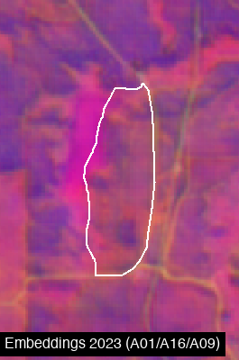

# datasets.alpha_embeddings


<!-- WARNING: THIS FILE WAS AUTOGENERATED! DO NOT EDIT! -->

## About Alpha Earth Embeddings

[Alpha Earth
Embeddings](https://developers.google.com/earth-engine/tutorials/community/satellite-embedding-01-introduction)
are 64-dimensional dense vector representations of satellite imagery
produced by Google.

Key features: - 64 embedding bands (A00-A63) - 10m resolution - Annual
composites from 2017 onwards - Unit-length vectors (no scaling needed) -
Captures semantic meaning from multi-sensor time-series

**Important**: Individual bands lack independent meaning. The 64
dimensions work together to encode spatial and temporal patterns. Use
all bands for similarity analysis, clustering, or machine learning.

------------------------------------------------------------------------

<a
href="https://github.com/aliceheiman/gee-polygons/blob/main/gee_polygons/datasets/alpha_embeddings.py#L33"
target="_blank" style="float:right; font-size:smaller">source</a>

### get_embedding_image

``` python

def get_embedding_image(
    geometry:Geometry, year:int, bands:list=None
)->Image:

```

*Get Alpha Earth Embedding image for a specific year.*

The collection stores annual images, so this filters to the requested
year and mosaics any tiles covering the geometry.

Args: geometry: Region of interest year: Year to retrieve (2017 onwards)
bands: Specific bands to select (default: all 64)

Returns: ee.Image with embedding bands

Example: img = get_embedding_image(site.geometry, 2023) img =
get_embedding_image(site.geometry, 2023, bands=\[‘A01’, ‘A16’, ‘A09’\])

## Usage

### Extracting Embedding Values

Use `extract_continuous` to get the mean embedding values for a polygon:

``` python
import ee
ee.Authenticate()
ee.Initialize(project='hs-brazilreforestation')
```

            <style>
                .geemap-dark {
                    --jp-widgets-color: white;
                    --jp-widgets-label-color: white;
                    --jp-ui-font-color1: white;
                    --jp-layout-color2: #454545;
                    background-color: #383838;
                }
&#10;                .geemap-dark .jupyter-button {
                    --jp-layout-color3: #383838;
                }
&#10;                .geemap-colab {
                    background-color: var(--colab-primary-surface-color, white);
                }
&#10;                .geemap-colab .jupyter-button {
                    --jp-layout-color3: var(--colab-primary-surface-color, white);
                }
            </style>
            &#10;

``` python
from gee_polygons.site import load_sites

sites = load_sites('../data/restoration_sites_subset.geojson')
site = sites[0]
print(site)
```

            <style>
                .geemap-dark {
                    --jp-widgets-color: white;
                    --jp-widgets-label-color: white;
                    --jp-ui-font-color1: white;
                    --jp-layout-color2: #454545;
                    background-color: #383838;
                }
&#10;                .geemap-dark .jupyter-button {
                    --jp-layout-color3: #383838;
                }
&#10;                .geemap-colab {
                    background-color: var(--colab-primary-surface-color, white);
                }
&#10;                .geemap-colab .jupyter-button {
                    --jp-layout-color3: var(--colab-primary-surface-color, white);
                }
            </style>
            &#10;

    Site(id=3107, start_year=2016)

``` python
# Extract embeddings for a year range
df = site.extract_continuous(
    ALPHA_EMBEDDINGS,
    start_date='2020-01-01',
    end_date='2023-12-31',
    reducer='mean',
    frequency='yearly'
)

print(f"Shape: {df.shape}")
print(f"Columns: site_id, year, A00-A63")
df.head()
```

            <style>
                .geemap-dark {
                    --jp-widgets-color: white;
                    --jp-widgets-label-color: white;
                    --jp-ui-font-color1: white;
                    --jp-layout-color2: #454545;
                    background-color: #383838;
                }
&#10;                .geemap-dark .jupyter-button {
                    --jp-layout-color3: #383838;
                }
&#10;                .geemap-colab {
                    background-color: var(--colab-primary-surface-color, white);
                }
&#10;                .geemap-colab .jupyter-button {
                    --jp-layout-color3: var(--colab-primary-surface-color, white);
                }
            </style>
            &#10;

    Shape: (4, 66)
    Columns: site_id, year, A00-A63

<div>
<style scoped>
    .dataframe tbody tr th:only-of-type {
        vertical-align: middle;
    }
&#10;    .dataframe tbody tr th {
        vertical-align: top;
    }
&#10;    .dataframe thead th {
        text-align: right;
    }
</style>

<table class="dataframe" data-quarto-postprocess="true" data-border="1">
<thead>
<tr style="text-align: right;">
<th data-quarto-table-cell-role="th"></th>
<th data-quarto-table-cell-role="th">site_id</th>
<th data-quarto-table-cell-role="th">year</th>
<th data-quarto-table-cell-role="th">A00</th>
<th data-quarto-table-cell-role="th">A01</th>
<th data-quarto-table-cell-role="th">A02</th>
<th data-quarto-table-cell-role="th">A03</th>
<th data-quarto-table-cell-role="th">A04</th>
<th data-quarto-table-cell-role="th">A05</th>
<th data-quarto-table-cell-role="th">A06</th>
<th data-quarto-table-cell-role="th">A07</th>
<th data-quarto-table-cell-role="th">...</th>
<th data-quarto-table-cell-role="th">A54</th>
<th data-quarto-table-cell-role="th">A55</th>
<th data-quarto-table-cell-role="th">A56</th>
<th data-quarto-table-cell-role="th">A57</th>
<th data-quarto-table-cell-role="th">A58</th>
<th data-quarto-table-cell-role="th">A59</th>
<th data-quarto-table-cell-role="th">A60</th>
<th data-quarto-table-cell-role="th">A61</th>
<th data-quarto-table-cell-role="th">A62</th>
<th data-quarto-table-cell-role="th">A63</th>
</tr>
</thead>
<tbody>
<tr>
<td data-quarto-table-cell-role="th">0</td>
<td>3107</td>
<td>2020</td>
<td>0.051429</td>
<td>0.103414</td>
<td>-0.159193</td>
<td>-0.128978</td>
<td>0.019833</td>
<td>0.130146</td>
<td>0.116706</td>
<td>0.241309</td>
<td>...</td>
<td>-0.006464</td>
<td>0.123972</td>
<td>0.067628</td>
<td>-0.031071</td>
<td>0.082864</td>
<td>0.035164</td>
<td>0.072382</td>
<td>-0.047027</td>
<td>-0.017532</td>
<td>-0.330571</td>
</tr>
<tr>
<td data-quarto-table-cell-role="th">1</td>
<td>3107</td>
<td>2021</td>
<td>0.079712</td>
<td>0.093320</td>
<td>-0.171368</td>
<td>-0.113680</td>
<td>0.016212</td>
<td>0.120561</td>
<td>0.149501</td>
<td>0.259941</td>
<td>...</td>
<td>-0.015321</td>
<td>0.116001</td>
<td>0.086228</td>
<td>-0.056849</td>
<td>0.071019</td>
<td>0.046415</td>
<td>0.060030</td>
<td>-0.051776</td>
<td>-0.019477</td>
<td>-0.331156</td>
</tr>
<tr>
<td data-quarto-table-cell-role="th">2</td>
<td>3107</td>
<td>2022</td>
<td>0.072090</td>
<td>0.123538</td>
<td>-0.181573</td>
<td>-0.112572</td>
<td>0.030015</td>
<td>0.146240</td>
<td>0.113321</td>
<td>0.265398</td>
<td>...</td>
<td>-0.012064</td>
<td>0.091692</td>
<td>0.071432</td>
<td>-0.052110</td>
<td>0.108490</td>
<td>0.017806</td>
<td>0.062049</td>
<td>-0.078349</td>
<td>0.009921</td>
<td>-0.345070</td>
</tr>
<tr>
<td data-quarto-table-cell-role="th">3</td>
<td>3107</td>
<td>2023</td>
<td>0.066441</td>
<td>0.094494</td>
<td>-0.165421</td>
<td>-0.116780</td>
<td>0.038526</td>
<td>0.126812</td>
<td>0.110835</td>
<td>0.276009</td>
<td>...</td>
<td>0.014570</td>
<td>0.084251</td>
<td>0.085341</td>
<td>-0.036375</td>
<td>0.095532</td>
<td>0.027515</td>
<td>0.093615</td>
<td>-0.077840</td>
<td>-0.020993</td>
<td>-0.327966</td>
</tr>
</tbody>
</table>

<p>4 rows × 66 columns</p>
</div>

``` python
# The embedding vector for a single year
embedding_2023 = df[df['year'] == 2023][EMBEDDING_BANDS].values[0]
print(f"2023 embedding shape: {embedding_2023.shape}")
print(f"First 10 values: {embedding_2023[:10]}")
```

            <style>
                .geemap-dark {
                    --jp-widgets-color: white;
                    --jp-widgets-label-color: white;
                    --jp-ui-font-color1: white;
                    --jp-layout-color2: #454545;
                    background-color: #383838;
                }
&#10;                .geemap-dark .jupyter-button {
                    --jp-layout-color3: #383838;
                }
&#10;                .geemap-colab {
                    background-color: var(--colab-primary-surface-color, white);
                }
&#10;                .geemap-colab .jupyter-button {
                    --jp-layout-color3: var(--colab-primary-surface-color, white);
                }
            </style>
            &#10;

    2023 embedding shape: (64,)
    First 10 values: [ 0.0664412   0.0944937  -0.16542051 -0.1167795   0.03852644  0.12681178
      0.11083481  0.27600854 -0.03367958 -0.02094349]

### Visualization

Since embeddings have 64 dimensions, we visualize by selecting 3 bands
for RGB. Different band combinations reveal different patterns:

``` python
from gee_polygons.visualize import render_image

# Get embedding image for visualization
emb_image = get_embedding_image(site.geometry, 2023)

# Render with default band combination
img = render_image(
    image=emb_image,
    region=site.geometry.buffer(500).bounds(),
    vis_params=EMBEDDING_VIS_DEFAULT,
    dimensions=400,
    boundary=site.geometry,
    label='Embeddings 2023 (A01/A16/A09)'
)
img
```

            <style>
                .geemap-dark {
                    --jp-widgets-color: white;
                    --jp-widgets-label-color: white;
                    --jp-ui-font-color1: white;
                    --jp-layout-color2: #454545;
                    background-color: #383838;
                }
&#10;                .geemap-dark .jupyter-button {
                    --jp-layout-color3: #383838;
                }
&#10;                .geemap-colab {
                    background-color: var(--colab-primary-surface-color, white);
                }
&#10;                .geemap-colab .jupyter-button {
                    --jp-layout-color3: var(--colab-primary-surface-color, white);
                }
            </style>
            &#10;



``` python
# Try different band combinations
from gee_polygons.visualize import export_frames_as_strip

band_combos = [
    (['A01', 'A16', 'A09'], 'Default'),
    (['A00', 'A32', 'A63'], 'Spread'),
    (['A05', 'A25', 'A45'], 'Alt'),
]

frames = []
for bands, name in band_combos:
    vis = {'min': -0.3, 'max': 0.3, 'bands': bands}
    frame = render_image(
        image=emb_image,
        region=site.geometry.buffer(500).bounds(),
        vis_params=vis,
        dimensions=500,
        boundary=site.geometry,
        label=name
    )
    frames.append(frame)

export_frames_as_strip(frames, '../outputs/embedding_band_combos.png')

from IPython.display import Image as IPImage
IPImage('../outputs/embedding_band_combos.png')
```

            <style>
                .geemap-dark {
                    --jp-widgets-color: white;
                    --jp-widgets-label-color: white;
                    --jp-ui-font-color1: white;
                    --jp-layout-color2: #454545;
                    background-color: #383838;
                }
&#10;                .geemap-dark .jupyter-button {
                    --jp-layout-color3: #383838;
                }
&#10;                .geemap-colab {
                    background-color: var(--colab-primary-surface-color, white);
                }
&#10;                .geemap-colab .jupyter-button {
                    --jp-layout-color3: var(--colab-primary-surface-color, white);
                }
            </style>
            &#10;


### Temporal Comparison

Compare embeddings across years to see how a site changes:

``` python
# Embedding timestrip 2018-2023
from gee_polygons.visualize import export_frames_as_gif

frames = []
for year in range(2018, 2025):
    emb_image = get_embedding_image(site.geometry, year)
    
    frame = render_image(
        image=emb_image,
        region=site.geometry.buffer(500).bounds(),
        vis_params=EMBEDDING_VIS_DEFAULT,
        dimensions=500,
        boundary=site.geometry,
        label=str(year)
    )
    frames.append(frame)

# Export as strip and GIF
export_frames_as_strip(frames, '../outputs/embedding_2018_2024.png')
export_frames_as_gif(frames, '../outputs/embedding_2018_2024.gif', duration_ms=700)

IPImage('../outputs/embedding_2018_2024.png')
```

            <style>
                .geemap-dark {
                    --jp-widgets-color: white;
                    --jp-widgets-label-color: white;
                    --jp-ui-font-color1: white;
                    --jp-layout-color2: #454545;
                    background-color: #383838;
                }
&#10;                .geemap-dark .jupyter-button {
                    --jp-layout-color3: #383838;
                }
&#10;                .geemap-colab {
                    background-color: var(--colab-primary-surface-color, white);
                }
&#10;                .geemap-colab .jupyter-button {
                    --jp-layout-color3: var(--colab-primary-surface-color, white);
                }
            </style>
            &#10;


### Similarity Analysis

Since embeddings are unit vectors, you can compute cosine similarity
between years:

``` python
import numpy as np

# Get embeddings for multiple years
df = site.extract_continuous(
    ALPHA_EMBEDDINGS,
    start_date='2018-01-01',
    end_date='2024-12-31',
    reducer='mean',
    frequency='yearly'
)

# Extract embedding vectors
years = df['year'].values
embeddings = df[EMBEDDING_BANDS].values

# Compute cosine similarity matrix
# Since vectors are unit length, cosine similarity = dot product
similarity_matrix = embeddings @ embeddings.T

print("Cosine similarity between years:")
import pandas as pd
sim_df = pd.DataFrame(similarity_matrix, index=years, columns=years)
sim_df.round(3)
```

            <style>
                .geemap-dark {
                    --jp-widgets-color: white;
                    --jp-widgets-label-color: white;
                    --jp-ui-font-color1: white;
                    --jp-layout-color2: #454545;
                    background-color: #383838;
                }
&#10;                .geemap-dark .jupyter-button {
                    --jp-layout-color3: #383838;
                }
&#10;                .geemap-colab {
                    background-color: var(--colab-primary-surface-color, white);
                }
&#10;                .geemap-colab .jupyter-button {
                    --jp-layout-color3: var(--colab-primary-surface-color, white);
                }
            </style>
            &#10;

    Cosine similarity between years:

<div>
<style scoped>
    .dataframe tbody tr th:only-of-type {
        vertical-align: middle;
    }
&#10;    .dataframe tbody tr th {
        vertical-align: top;
    }
&#10;    .dataframe thead th {
        text-align: right;
    }
</style>

<table class="dataframe" data-quarto-postprocess="true" data-border="1">
<thead>
<tr style="text-align: right;">
<th data-quarto-table-cell-role="th"></th>
<th data-quarto-table-cell-role="th">2018</th>
<th data-quarto-table-cell-role="th">2019</th>
<th data-quarto-table-cell-role="th">2020</th>
<th data-quarto-table-cell-role="th">2021</th>
<th data-quarto-table-cell-role="th">2022</th>
<th data-quarto-table-cell-role="th">2023</th>
<th data-quarto-table-cell-role="th">2024</th>
</tr>
</thead>
<tbody>
<tr>
<td data-quarto-table-cell-role="th">2018</td>
<td>0.920</td>
<td>0.902</td>
<td>0.910</td>
<td>0.897</td>
<td>0.883</td>
<td>0.898</td>
<td>0.887</td>
</tr>
<tr>
<td data-quarto-table-cell-role="th">2019</td>
<td>0.902</td>
<td>0.920</td>
<td>0.901</td>
<td>0.899</td>
<td>0.886</td>
<td>0.903</td>
<td>0.892</td>
</tr>
<tr>
<td data-quarto-table-cell-role="th">2020</td>
<td>0.910</td>
<td>0.901</td>
<td>0.921</td>
<td>0.907</td>
<td>0.897</td>
<td>0.907</td>
<td>0.895</td>
</tr>
<tr>
<td data-quarto-table-cell-role="th">2021</td>
<td>0.897</td>
<td>0.899</td>
<td>0.907</td>
<td>0.923</td>
<td>0.904</td>
<td>0.909</td>
<td>0.896</td>
</tr>
<tr>
<td data-quarto-table-cell-role="th">2022</td>
<td>0.883</td>
<td>0.886</td>
<td>0.897</td>
<td>0.904</td>
<td>0.906</td>
<td>0.900</td>
<td>0.886</td>
</tr>
<tr>
<td data-quarto-table-cell-role="th">2023</td>
<td>0.898</td>
<td>0.903</td>
<td>0.907</td>
<td>0.909</td>
<td>0.900</td>
<td>0.919</td>
<td>0.911</td>
</tr>
<tr>
<td data-quarto-table-cell-role="th">2024</td>
<td>0.887</td>
<td>0.892</td>
<td>0.895</td>
<td>0.896</td>
<td>0.886</td>
<td>0.911</td>
<td>0.917</td>
</tr>
</tbody>
</table>

</div>
