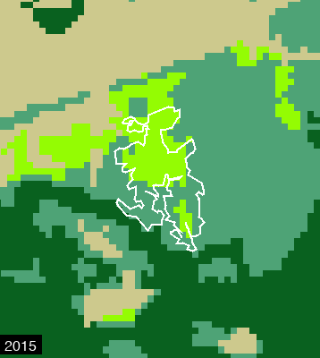
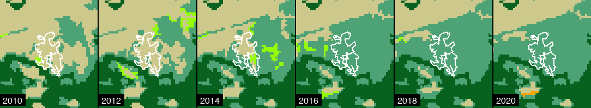
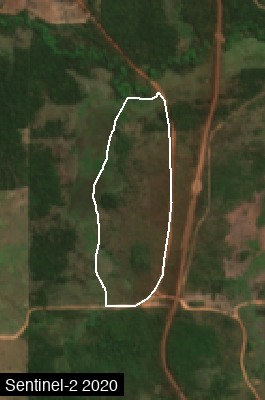
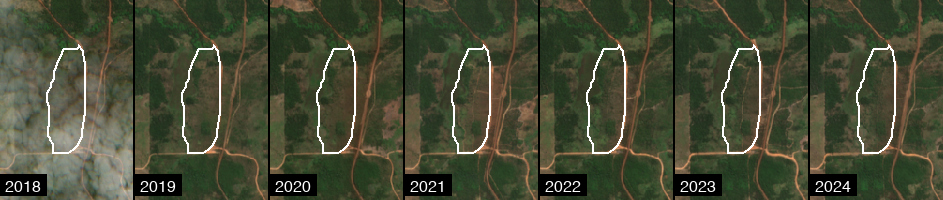

# visualize


<!-- WARNING: THIS FILE WAS AUTOGENERATED! DO NOT EDIT! -->

## Visualization Parameters

A simple wrapper for GEE visualization parameters.

------------------------------------------------------------------------

<a
href="https://github.com/aliceheiman/gee-polygons/blob/main/gee_polygons/visualize.py#L23"
target="_blank" style="float:right; font-size:smaller">source</a>

### VisParams

``` python

def VisParams(
    min:Optional=None, max:Optional=None, palette:Optional=None, bands:Optional=None, gamma:Optional=None
)->None:

```

*Visualization parameters for rendering layers.*

Examples: \# For single-band continuous data (NDVI, temperature)
VisParams(min=-0.2, max=0.8, palette=\[‘red’, ‘yellow’, ‘green’\])

    # For RGB composites
    VisParams(min=0, max=0.3, bands=['B4', 'B3', 'B2'], gamma=1.4)

    # For categorical data
    VisParams(min=0, max=7, palette=['#111', '#ccc', '#0f0', ...])

## Core Rendering Functions

These are the building blocks - they work with any `ee.Image`.

------------------------------------------------------------------------

<a
href="https://github.com/aliceheiman/gee-polygons/blob/main/gee_polygons/visualize.py#L70"
target="_blank" style="float:right; font-size:smaller">source</a>

### render_thumbnail

``` python

def render_thumbnail(
    image:Image, region:Geometry, vis_params:dict, dimensions:int=512, format:str='png'
)->bytes:

```

*Render an ee.Image to thumbnail bytes.*

Args: image: The image to render region: Region to render vis_params:
Visualization parameters dict dimensions: Max dimension in pixels
format: Image format (‘png’ or ‘jpg’)

Returns: Image bytes

------------------------------------------------------------------------

<a
href="https://github.com/aliceheiman/gee-polygons/blob/main/gee_polygons/visualize.py#L101"
target="_blank" style="float:right; font-size:smaller">source</a>

### add_label

``` python

def add_label(
    img:Image, label:str, position:Literal='bottom-left', font_size:int=16, text_color:str='white',
    bg_color:str='black', padding:int=5
)->Image:

```

*Add a text label to an image.*

## Generic Image Rendering

The core
[`render_image`](https://aliceheiman.github.io/gee-polygons/visualize.html#render_image)
function works with **any** `ee.Image`.

------------------------------------------------------------------------

<a
href="https://github.com/aliceheiman/gee-polygons/blob/main/gee_polygons/visualize.py#L162"
target="_blank" style="float:right; font-size:smaller">source</a>

### render_image

``` python

def render_image(
    image:Image, region:Geometry, vis_params:Union, dimensions:int=512, boundary:Optional=None,
    boundary_color:str='#FFFFFF', boundary_width:int=2, label:Optional=None, label_position:str='bottom-left'
)->Image:

```

*Render any ee.Image to a PIL Image.*

This is the core generic rendering function. It works with any ee.Image
from any source (Sentinel, MODIS, Landsat, custom computations, etc.).

Args: image: Any ee.Image to visualize region: Region to render (usually
site.geometry.buffer(n).bounds()) vis_params: Visualization parameters
(VisParams or dict) dimensions: Image size in pixels boundary: Optional
geometry to overlay as boundary line boundary_color: Color for boundary
line boundary_width: Width of boundary line label: Optional text label
label_position: Position for label

Returns: PIL Image

Example: \# Get any ee.Image from any source image =
ee.Image(‘USGS/SRTMGL1_003’) \# elevation

    # Render it
    pil_img = render_image(
        image=image,
        region=site.geometry.buffer(1000).bounds(),
        vis_params={'min': 0, 'max': 3000, 'palette': ['green', 'yellow', 'brown']},
        boundary=site.geometry,
        label='Elevation'
    )

## Layer-Based Rendering

Convenience functions for rendering
[`CategoricalLayer`](https://aliceheiman.github.io/gee-polygons/layers.html#categoricallayer)
and
[`ContinuousLayer`](https://aliceheiman.github.io/gee-polygons/layers.html#continuouslayer)
objects.

------------------------------------------------------------------------

<a
href="https://github.com/aliceheiman/gee-polygons/blob/main/gee_polygons/visualize.py#L249"
target="_blank" style="float:right; font-size:smaller">source</a>

### get_image_for_layer

``` python

def get_image_for_layer(
    layer:Union, geometry:Geometry, year:Optional=None, date_range:Optional=None, reducer:str='median'
)->Image:

```

*Get an ee.Image from a CategoricalLayer or ContinuousLayer.*

------------------------------------------------------------------------

<a
href="https://github.com/aliceheiman/gee-polygons/blob/main/gee_polygons/visualize.py#L235"
target="_blank" style="float:right; font-size:smaller">source</a>

### get_vis_params_from_layer

``` python

def get_vis_params_from_layer(
    layer:CategoricalLayer
)->dict:

```

*Extract visualization params from a CategoricalLayer’s palette.*

------------------------------------------------------------------------

<a
href="https://github.com/aliceheiman/gee-polygons/blob/main/gee_polygons/visualize.py#L296"
target="_blank" style="float:right; font-size:smaller">source</a>

### render_site_layer

``` python

def render_site_layer(
    site:Site, layer:Union, year:Optional=None, date_range:Optional=None, vis_params:Union=None, buffer_m:float=500,
    dimensions:int=512, show_boundary:bool=True, boundary_color:str='#FFFFFF', boundary_width:int=2,
    label:Optional=None, label_position:str='bottom-left'
)->Image:

```

*Render a CategoricalLayer or ContinuousLayer for a site.*

This is a convenience wrapper around render_image() for Layer objects.

## Generic Export Functions

These work with any rendering function via a “frame generator” pattern.

------------------------------------------------------------------------

<a
href="https://github.com/aliceheiman/gee-polygons/blob/main/gee_polygons/visualize.py#L370"
target="_blank" style="float:right; font-size:smaller">source</a>

### export_frames_as_strip

``` python

def export_frames_as_strip(
    frames:list, output_path:Union, orientation:Literal='horizontal', spacing:int=2, background_color:str='#000000'
)->Path:

```

*Export a list of PIL Images as a strip (side by side).*

Args: frames: List of PIL Images (should be same size) output_path:
Output file path orientation: ‘horizontal’ or ‘vertical’ spacing: Pixels
between tiles background_color: Background color

Returns: Path to saved file

------------------------------------------------------------------------

<a
href="https://github.com/aliceheiman/gee-polygons/blob/main/gee_polygons/visualize.py#L340"
target="_blank" style="float:right; font-size:smaller">source</a>

### export_frames_as_gif

``` python

def export_frames_as_gif(
    frames:list, output_path:Union, duration_ms:int=500, loop:bool=True
)->Path:

```

*Export a list of PIL Images as animated GIF.*

Args: frames: List of PIL Images output_path: Output file path
duration_ms: Frame duration in milliseconds loop: Whether to loop

Returns: Path to saved file

## High-Level Export Functions

Convenient wrappers for common use cases with Layer objects.

------------------------------------------------------------------------

<a
href="https://github.com/aliceheiman/gee-polygons/blob/main/gee_polygons/visualize.py#L450"
target="_blank" style="float:right; font-size:smaller">source</a>

### export_layer_timestrip

``` python

def export_layer_timestrip(
    site:Site, layer:Union, output_path:Union, years:list, vis_params:Union=None, buffer_m:float=500,
    tile_size:int=256, show_boundary:bool=True, boundary_color:str='#FFFFFF', add_labels:bool=True,
    orientation:Literal='horizontal', spacing:int=2
)->Path:

```

*Export a Layer time series as timestrip.*

------------------------------------------------------------------------

<a
href="https://github.com/aliceheiman/gee-polygons/blob/main/gee_polygons/visualize.py#L422"
target="_blank" style="float:right; font-size:smaller">source</a>

### export_layer_gif

``` python

def export_layer_gif(
    site:Site, layer:Union, output_path:Union, years:list, vis_params:Union=None, buffer_m:float=500,
    dimensions:int=512, show_boundary:bool=True, boundary_color:str='#FFFFFF', duration_ms:int=500,
    add_labels:bool=True
)->Path:

```

*Export a Layer time series as animated GIF.*

## Example Usage

``` python
import ee
ee.Authenticate()
ee.Initialize(project='hs-brazilreforestation')
```

            <style>
                .geemap-dark {
                    --jp-widgets-color: white;
                    --jp-widgets-label-color: white;
                    --jp-ui-font-color1: white;
                    --jp-layout-color2: #454545;
                    background-color: #383838;
                }
&#10;                .geemap-dark .jupyter-button {
                    --jp-layout-color3: #383838;
                }
&#10;                .geemap-colab {
                    background-color: var(--colab-primary-surface-color, white);
                }
&#10;                .geemap-colab .jupyter-button {
                    --jp-layout-color3: var(--colab-primary-surface-color, white);
                }
            </style>
            &#10;

``` python
from gee_polygons.site import load_sites
from gee_polygons.datasets.mapbiomas import MAPBIOMAS_DEFREG

sites = load_sites('../data/restoration_sites_subset.geojson')
site = sites[8]
print(site)
```

            <style>
                .geemap-dark {
                    --jp-widgets-color: white;
                    --jp-widgets-label-color: white;
                    --jp-ui-font-color1: white;
                    --jp-layout-color2: #454545;
                    background-color: #383838;
                }
&#10;                .geemap-dark .jupyter-button {
                    --jp-layout-color3: #383838;
                }
&#10;                .geemap-colab {
                    background-color: var(--colab-primary-surface-color, white);
                }
&#10;                .geemap-colab .jupyter-button {
                    --jp-layout-color3: var(--colab-primary-surface-color, white);
                }
            </style>
            &#10;

    Site(id=9368, start_year=2012)

### Using Layer objects (CategoricalLayer, ContinuousLayer)

``` python
# Render a categorical layer
img = render_site_layer(
    site=site,
    layer=MAPBIOMAS_DEFREG,
    year=2015,
    buffer_m=500,
    dimensions=400,
    label='2015'
)

# Save single frame as PNG
img.save('../outputs/defreg_2015.png')
img
```

            <style>
                .geemap-dark {
                    --jp-widgets-color: white;
                    --jp-widgets-label-color: white;
                    --jp-ui-font-color1: white;
                    --jp-layout-color2: #454545;
                    background-color: #383838;
                }
&#10;                .geemap-dark .jupyter-button {
                    --jp-layout-color3: #383838;
                }
&#10;                .geemap-colab {
                    background-color: var(--colab-primary-surface-color, white);
                }
&#10;                .geemap-colab .jupyter-button {
                    --jp-layout-color3: var(--colab-primary-surface-color, white);
                }
            </style>
            &#10;



``` python
# Export as timestrip (PNG)
export_layer_timestrip(
    site=site,
    layer=MAPBIOMAS_DEFREG,
    output_path='../outputs/defreg_timestrip.png',
    years=[2010, 2012, 2014, 2016, 2018, 2020],
    buffer_m=500,
    tile_size=200
)

# Export as animated GIF
export_layer_gif(
    site=site,
    layer=MAPBIOMAS_DEFREG,
    output_path='../outputs/defreg_timelapse.gif',
    years=range(2010, 2021),
    buffer_m=500,
    dimensions=300,
    duration_ms=600
)

from IPython.display import Image as IPImage
IPImage('../outputs/defreg_timestrip.png')
```

            <style>
                .geemap-dark {
                    --jp-widgets-color: white;
                    --jp-widgets-label-color: white;
                    --jp-ui-font-color1: white;
                    --jp-layout-color2: #454545;
                    background-color: #383838;
                }
&#10;                .geemap-dark .jupyter-button {
                    --jp-layout-color3: #383838;
                }
&#10;                .geemap-colab {
                    background-color: var(--colab-primary-surface-color, white);
                }
&#10;                .geemap-colab .jupyter-button {
                    --jp-layout-color3: var(--colab-primary-surface-color, white);
                }
            </style>
            &#10;



### Using generic render_image with any ee.Image

For custom imagery or datasets not wrapped in Layer objects:

``` python
site = sites[0]
```

            <style>
                .geemap-dark {
                    --jp-widgets-color: white;
                    --jp-widgets-label-color: white;
                    --jp-ui-font-color1: white;
                    --jp-layout-color2: #454545;
                    background-color: #383838;
                }
&#10;                .geemap-dark .jupyter-button {
                    --jp-layout-color3: #383838;
                }
&#10;                .geemap-colab {
                    background-color: var(--colab-primary-surface-color, white);
                }
&#10;                .geemap-colab .jupyter-button {
                    --jp-layout-color3: var(--colab-primary-surface-color, white);
                }
            </style>
            &#10;

``` python
# Example: Render elevation data
elevation = ee.Image('USGS/SRTMGL1_003')

img = render_image(
    image=elevation,
    region=site.geometry.buffer(2000).bounds(),
    vis_params={'min': 0, 'max': 500, 'palette': ['#0d0887', '#7e03a8', '#cc4778', '#f89540', '#f0f921']},
    dimensions=400,
    boundary=site.geometry,
    label='Elevation (m)'
)
img
```

            <style>
                .geemap-dark {
                    --jp-widgets-color: white;
                    --jp-widgets-label-color: white;
                    --jp-ui-font-color1: white;
                    --jp-layout-color2: #454545;
                    background-color: #383838;
                }
&#10;                .geemap-dark .jupyter-button {
                    --jp-layout-color3: #383838;
                }
&#10;                .geemap-colab {
                    background-color: var(--colab-primary-surface-color, white);
                }
&#10;                .geemap-colab .jupyter-button {
                    --jp-layout-color3: var(--colab-primary-surface-color, white);
                }
            </style>
            &#10;


``` python
# Example: Sentinel-2 using the dataset helper
from gee_polygons.datasets.sentinel2 import get_sentinel_composite, SENTINEL_VIS

s2_image = get_sentinel_composite(
    geometry=site.geometry,
    date_range=('2020-06-01', '2020-08-31')
)

img = render_image(
    image=s2_image,
    region=site.geometry.buffer(500).bounds(),
    vis_params=SENTINEL_VIS,
    dimensions=400,
    boundary=site.geometry,
    label='Sentinel-2 2020'
)
img
```

            <style>
                .geemap-dark {
                    --jp-widgets-color: white;
                    --jp-widgets-label-color: white;
                    --jp-ui-font-color1: white;
                    --jp-layout-color2: #454545;
                    background-color: #383838;
                }
&#10;                .geemap-dark .jupyter-button {
                    --jp-layout-color3: #383838;
                }
&#10;                .geemap-colab {
                    background-color: var(--colab-primary-surface-color, white);
                }
&#10;                .geemap-colab .jupyter-button {
                    --jp-layout-color3: var(--colab-primary-surface-color, white);
                }
            </style>
            &#10;



### Sentinel-2 Timestrip (2018-2024)

Create a side-by-side comparison of dry season Sentinel-2 composites
across multiple years.

``` python
# Sentinel-2 timestrip: dry season composites 2018-2024
from gee_polygons.datasets.sentinel2 import get_sentinel_composite, SENTINEL_VIS

frames = []
for year in range(2018, 2025):
    # Get dry season composite (June-August)
    s2_image = get_sentinel_composite(
        geometry=site.geometry,
        date_range=(f'{year}-06-01', f'{year}-08-31'),
        cloud_pct=20
    )
    
    # Render to PIL Image with label
    frame = render_image(
        image=s2_image,
        region=site.geometry.buffer(500).bounds(),
        vis_params=SENTINEL_VIS,
        dimensions=200,
        boundary=site.geometry,
        label=str(year)
    )
    frames.append(frame)

# Export as horizontal strip
export_frames_as_strip(frames, '../outputs/sentinel_2018_2024.png')

from IPython.display import Image as IPImage
IPImage('../outputs/sentinel_2018_2024.png')
```

            <style>
                .geemap-dark {
                    --jp-widgets-color: white;
                    --jp-widgets-label-color: white;
                    --jp-ui-font-color1: white;
                    --jp-layout-color2: #454545;
                    background-color: #383838;
                }
&#10;                .geemap-dark .jupyter-button {
                    --jp-layout-color3: #383838;
                }
&#10;                .geemap-colab {
                    background-color: var(--colab-primary-surface-color, white);
                }
&#10;                .geemap-colab .jupyter-button {
                    --jp-layout-color3: var(--colab-primary-surface-color, white);
                }
            </style>
            &#10;



``` python
# Also export as animated GIF
export_frames_as_gif(frames, '../outputs/sentinel_2018_2024.gif', duration_ms=700)
```

            <style>
                .geemap-dark {
                    --jp-widgets-color: white;
                    --jp-widgets-label-color: white;
                    --jp-ui-font-color1: white;
                    --jp-layout-color2: #454545;
                    background-color: #383838;
                }
&#10;                .geemap-dark .jupyter-button {
                    --jp-layout-color3: #383838;
                }
&#10;                .geemap-colab {
                    background-color: var(--colab-primary-surface-color, white);
                }
&#10;                .geemap-colab .jupyter-button {
                    --jp-layout-color3: var(--colab-primary-surface-color, white);
                }
            </style>
            &#10;

    Path('../outputs/sentinel_2018_2024.gif')
